# KVN Construction ERD

```mermaid
erDiagram
    users ||--o{ clients : owns
    users ||--o{ user_sessions : opens
    users ||--o{ remember_tokens : persists
    users ||--o{ user_otps : receives
    users ||--o{ leads : assigned_to
    users ||--o{ projects : client_or_creator
    users ||--o{ quotations : creates_or_approves
    users ||--o{ support_tickets : opens
    users ||--o{ support_messages : sends
    users ||--o{ blogs : authors
    users ||--o{ media : uploads

    roles ||--o{ user_roles : maps
    permissions ||--o{ role_permissions : maps

    blog_categories ||--o{ blogs : groups
    blogs ||--o{ blog_comments : has

    construction_packages ||--o{ estimator_pricing : prices
    construction_packages ||--o{ estimator_requests : selected
    estimator_requests ||--o{ estimator_calculation_log : audited

    lead_statuses ||--o{ leads : classifies
    leads ||--o{ lead_activities : tracks
    leads ||--o{ lead_followups : schedules

    projects ||--o{ project_milestones : has
    projects ||--o{ project_updates : has
    projects ||--o{ project_gallery : has
    projects ||--o{ project_media : has
    projects ||--o{ project_files : has
    projects ||--o{ project_tasks : has
    projects ||--o{ payments : receives
    projects ||--o{ quotations : quoted_for

    quotations ||--o{ quotation_items : contains
    quotations ||--o{ quotation_versions : versions
    quotations ||--o{ quotation_downloads : downloads

    support_tickets ||--o{ support_messages : contains
    users ||--o{ security_logs : generates
    users ||--o{ audit_logs : generates

    users ||--o{ payment_transactions : pays
    users ||--o{ payment_receipts : receives
    users ||--o{ client_messages : exchanges
    users ||--o{ client_notifications : receives
    users ||--o{ client_feedback : submits
    users ||--o{ client_documents : owns
    users ||--o{ client_permits : owns
    users ||--o{ client_agreements : owns
    users ||--o{ client_downloads : downloads
    users ||--o{ client_quotations : receives

    media ||--o{ media_derivatives : generates
```

## Notes
- The ERD shows the canonical entities that are directly exercised by the current PHP code.
- Compatibility views are intentionally omitted from the diagram to keep the model readable.
- The live schema also includes compatibility aliases such as `client_payments`, `project_schedules`, `blog_posts`, and `estimators`.
