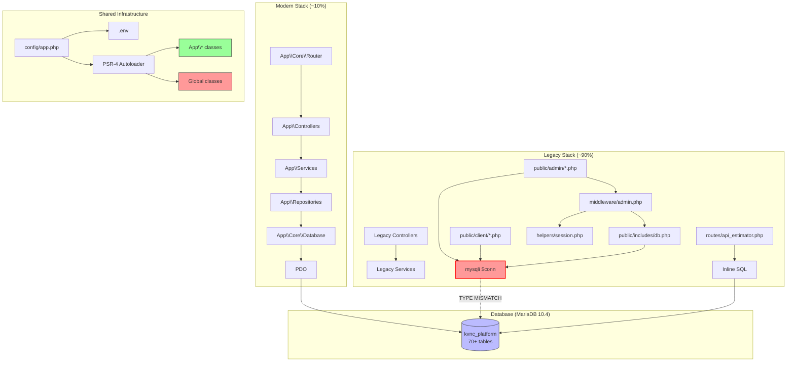
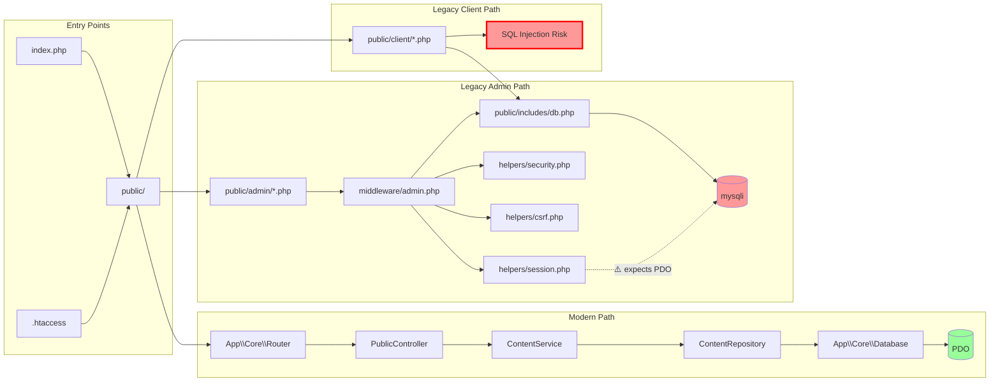

# DEPENDENCY ANALYSIS - FINAL RISK REPORT & EXECUTIVE SUMMARY

> Generated: Complete architectural dependency analysis of KVN Construction Platform
> Scope: ~280 PHP files, 8 JS, 4 CSS, 5 SQL, 4 config, 2 Docker, 16 test files
> Analysis Date: Complete repository audit

---

## 1. EXECUTIVE SUMMARY

KVN Construction is a PHP 8.2 construction management platform in **active migration** from legacy procedural architecture to modern PSR-4 object-oriented architecture.

### Architecture Split
| Architecture | Files | Percentage | Status |
|-------------|-------|------------|--------|
| Modern PSR-4 (App\*) | ~24 | ~10% | ✅ Active |
| Legacy OOP (global ns) | ~20 | ~8% | ⚠️ Mixed |
| Legacy procedural | ~90 | ~38% | 🔴 Needs migration |
| Public/Admin legacy pages | ~90 | ~38% | 🔴 Needs migration |
| Assets/Config/Docker | ~56 | ~6% | ✅ Stable |

---

## 2. DEPENDENCY STATISTICS

### Most Coupled Files (Top 20)

| Rank | File | Dependencies | Dependents | Coupling Score |
|------|------|-------------|-----------|----------------|
| 1 | `config/app.php` | 15 (env, const, autoloader) | 110+ files | 🔴 **125** |
| 2 | `helpers/session.php` | 8 ($GLOBALS[conn], functions) | 90+ files | 🔴 **98** |
| 3 | `middleware/admin.php` | 6 (helpers, db, settings) | 70+ files | 🔴 **76** |
| 4 | `public/includes/db.php` | 1 (mysqli) | 90+ files | 🔴 **91** |
| 5 | `helpers/security.php` | 5 (functions) | 60+ files | 🟠 **65** |
| 6 | `helpers/csrf.php` | 3 (functions) | 50+ files | 🟠 **53** |
| 7 | `bootstrap/providers/ServiceProvider.php` | 10 (services, repos) | 30+ files | 🟠 **40** |
| 8 | `app/Core/Database.php` | 3 (PDO, env) | 20+ files | 🟠 **23** |
| 9 | `core/Model.php` | 2 (Database) | 2 files | 🟢 **4** |
| 10 | `app/repositories/UserRepository.php` | 2 (PDO, parent) | 6 files | 🟢 **8** |
| 11 | `app/services/LeadService.php` | 3 (repo, PDO) | 4 files | 🟢 **7** |
| 12 | `app/controllers/AdminController.php` | 6 (services, repos) | 1 file | 🟢 **7** |
| 13 | `helpers/upload.php` | 4 (functions, config) | 8 files | 🟢 **12** |
| 14 | `helpers/rateLimiter.php` | 3 ($GLOBALS[conn]) | 8 files | 🟢 **11** |
| 15 | `helpers/auth.php` | 5 (session, security) | 5 files | 🟢 **10** |
| 16 | `core/Event.php` | 2 (logSecurityEvent) | 1 file | 🟢 **3** |
| 17 | `core/View.php` | 1 (file system) | 10+ files | 🟢 **11** |
| 18 | `helpers/functions.php` | 1 (helper chain) | 5 files | 🟢 **6** |
| 19 | `app/Core/SessionManager.php` | 2 (session, cookie) | 4 files | 🟢 **6** |
| 20 | `app/Core/Router.php` | 3 (controllers, views) | 2 files | 🟢 **5** |

---

## 3. ARCHITECTURAL HEALTH SCORE

| Category | Score (0-100) | Assessment |
|----------|--------------|------------|
| **PSR-4 Compliance** | 15/100 | Only ~10% uses PSR-4 properly |
| **Separation of Concerns** | 30/100 | Business logic in controllers, SQL in views |
| **Dependency Injection** | 20/100 | Mixed - some DI, mostly `new` keyword |
| **Single Responsibility** | 25/100 | God classes (AdminController, helpers/session.php) |
| **DRY Compliance** | 40/100 | Extensive duplication (24+ instances) |
| **Security Posture** | 35/100 | CSRF, prepared statements exist but mixed with raw SQL |
| **Testing Coverage** | 10/100 | 16 test files, mostly debug scripts |
| **Error Handling** | 25/100 | die()/exit() instead of exceptions |
| **Configuration Management** | 50/100 | .env + constants, but mixed hardcoded values |
| **Database Layer** | 40/100 | PDO + migrations exist, but mysqli legacy bridge |
| **Routing System** | 40/100 | Modern router exists but 90% uses direct PHP files |
| **Session Management** | 30/100 | 4 competing implementations |

### OVERALL ARCHITECTURAL HEALTH: **30/100** 🔴 Critical

---

## 4. TECHNICAL DEBT SCORE

| Debt Category | Lines | Severity | Est. Fix Hours |
|--------------|-------|----------|----------------|
| Duplicate implementations | ~3,500 | 🔴 HIGH | 40 |
| Legacy procedural code | ~10,000 | 🔴 HIGH | 120 |
| Dead code | ~1,700 | 🟠 MEDIUM | 2 |
| Missing namespaces | ~5,000 | 🟠 MEDIUM | 30 |
| Inline SQL in views/controllers | ~1,500 | 🔴 CRITICAL | 20 |
| Debug code in production | ~50 | 🟠 MEDIUM | 1 |
| No type hints (legacy code) | ~8,000 | 🟡 LOW | 40 |
| Missing error handling (die()) | ~45 calls | 🟠 MEDIUM | 8 |
| **TOTAL** | **~29,795** | | **261 hours** |

### CODE QUALITY METRICS
| Metric | Value |
|--------|-------|
| Total lines of PHP | ~37,000 |
| Lines of legacy code | ~33,000 (89%) |
| Lines of modern code | ~4,000 (11%) |
| die()/exit() calls | ~60 |
| var_dump() in production | 2 |
| SQL injection risks | 1 (confirmed) |
| PDO/mysqli conflict | 1 (confirmed) |

---

## 5. SAFE DELETION CANDIDATES

### ✅ CONFIRMED SAFE TO DELETE (after verification)

| # | File | Reason | Zero References Confirmed |
|---|------|--------|--------------------------|
| 1 | `core/Router.php` | Never instantiated, superseded by `App\Core\Router` | ✅ Yes |
| 2 | `_crawl_test.php` | Debug script | ✅ Yes |
| 3 | `_debug.php` | Debug script | ✅ Yes |
| 4 | `_fix.php` | Debug script | ✅ Yes |
| 5 | `_runtime_test.php` | Debug script | ✅ Yes |
| 6 | `_simple.php` | Debug script | ✅ Yes |
| 7 | `_static_analysis.php` | Debug script | ✅ Yes |
| 8 | `tests/debug_fixture_rows.php` | Debug script | ✅ Yes |
| 9 | `tests/debug_otp_select.php` | Debug script | ✅ Yes |
| 10 | `tests/debug_output.txt` | Debug artifact | ✅ Yes |
| 11 | `tests/debug_step*.txt` (8) | Debug artifacts | ✅ Yes |
| 12 | `tests/run_captured.php` | Debug script | ✅ Yes |
| 13 | `tests/run_wrapper.php` | Debug script | ✅ Yes |
| 14 | `tests/run_tiny.php` | Debug script | ✅ Yes |
| 15 | `tests/run_minimal.php` | Debug script | ✅ Yes |
| 16 | `public/admin/repo_tree.md` | Documentation in admin | ⚠️ Review needed |
| 17 | `public/client/repo_tree.md` | Documentation in client | ⚠️ Review needed |

### ⚠️ REQUIRES REVIEW (migration needed before deletion)

| # | File | Issue | Migration Required |
|---|------|-------|-------------------|
| 1 | `core/Model.php` | Broken `connect()` call | Refactor models |
| 2 | `config/database.php` | Duplicate of App\Core\Database | Consolidate connections |
| 3 | `helpers/session.php` (1110 lines) | Superseded by App\Core\SessionManager | Migrate middleware |
| 4 | `helpers/auth.php` | Superseded by AuthService | Migrate references |
| 5 | `helpers/otp.php` | Raw define() calls | Guard constants |
| 6 | `helpers/upload.php` | Raw define() for ALLOWED types | Guard constants |

---

## 6. RECOMMENDED REFACTORING ORDER

### Phase Order by Risk/Impact

```
Phase 1: 🔴 CRITICAL (2-3 days)
├── Fix PDO/mysqli type mismatch ($GLOBALS['conn'])
├── Fix SQL injection in public/client/payments/invoices.php
├── Guard raw define() in helpers/otp.php, helpers/upload.php
└── Fix core/Model.php::connect() → getConnection()

Phase 2: 🟠 HIGH (3-5 days)
├── Consolidate auth functions (is_logged_in/isLoggedIn, etc.)
├── Consolidate session management (4 → 1 implementation)
├── Remove core/Router.php (dead code)
└── Guard all test file define() calls

Phase 3: 🟡 MEDIUM (5-10 days)
├── Namespace all global classes (AuthController, LeadRepository, etc.)
├── Move inline SQL from controllers to repositories
├── Move business logic from controllers to services
├── Add type hints to all methods
├── Replace die() with proper exception handling
└── Create missing repositories (BlogRepository, etc.)

Phase 4: 🟢 LOW (ongoing)
├── Consolidate duplicate helper functions
├── Add PHPUnit test coverage
├── Webpack/Vite for asset bundling
├── Docker compose for production
├── CI/CD pipeline
└── API documentation
```

---

## 7. DATABASE MIGRATION READINESS SCORE

| Assessment | Score | Details |
|------------|-------|---------|
| Schema quality | 70/100 | Normalized, foreign keys, indexes, triggers |
| Duplicate tables | 30/100 | 5 duplicate table pairs (blogs/blog_posts, portfolio/portfolio_projects, etc.) |
| Missing indexes | 80/100 | Good coverage already in schema |
| Foreign key coverage | 85/100 | Most relationships have FK constraints |
| Migration strategy | 60/100 | Consolidation SQL prepared but not applied |
| Data integrity | 90/100 | UUIDs, timestamps, audit fields present |
| UTF8MB4 compliance | 100/100 | All tables use utf8mb4_unicode_ci |

### OVERALL DATABASE READINESS: **70/100** 🟠

### Duplicate Tables Requiring Consolidation

| Canonical Table | Duplicate Table | Status |
|----------------|----------------|--------|
| `blogs` | `blog_posts` | View created |
| `portfolio` | `portfolio_projects` | View created |
| `estimator_requests` | `estimators`, `estimator_leads` | View created |
| `projects` | `client_projects` | View created |

### Missing Foreign Keys (Potential Additions)

| Table | Column | References | Benefit |
|-------|--------|-----------|---------|
| `client_payments` | `client_id` | `users(id)` | Referential integrity |
| `client_invoices` | `client_id` | `users(id)` | Referential integrity |
| `payment_receipts` | `client_id` | `users(id)` | Referential integrity |
| `payment_transactions` | `client_id` | `users(id)` | Referential integrity |

---

## 8. PRODUCTION READINESS SCORE

| Category | Score | Issues |
|----------|-------|--------|
| **Error Handling** | 25/100 | die() instead of exceptions, no global handler |
| **Security Headers** | 70/100 | .htaccess has headers, CSP missing |
| **CSRF Protection** | 60/100 | Implemented but not universal |
| **Rate Limiting** | 50/100 | 3 implementations, inconsistent |
| **Input Validation** | 40/100 | Mixed - some prepared, some raw queries |
| **Session Security** | 35/100 | 4 implementations, $GLOBALS[conn] issue |
| **Logging** | 45/100 | Audit logs exist but no centralized logger |
| **Caching** | 10/100 | No application caching layer |
| **Asset Pipeline** | 30/100 | npm build exists but minified assets are fragile |
| **CI/CD** | 0/100 | No pipeline |
| **Monitoring** | 0/100 | No APM, no health checks |
| **Backups** | 0/100 | No backup automation |
| **Docker** | 20/100 | Dockerfile exists but incomplete |
| **Documentation** | 50/100 | Reports exist but code comments sparse |

### **OVERALL PRODUCTION READINESS: 30/100 🔴 Critical**

---

## 9. RISK ASSESSMENT BY SUBSYSTEM

| Subsystem | Risk Level | Files at Risk | Priority |
|-----------|-----------|--------------|----------|
| **Session/Auth** | 🔴 **CRITICAL** | helpers/session.php, helpers/auth.php, App\Core\SessionManager, AuthService | P0 |
| **Database Layer** | 🔴 **CRITICAL** | $GLOBALS[conn] type mismatch, core/Model.php::connect() | P0 |
| **Payment Pages** | 🔴 **CRITICAL** | public/client/payments/invoices.php (SQL injection) | P0 |
| **Middleware** | 🟠 **HIGH** | admin.php, auth.php, client.php (brand on $GLOBALS[conn]) | P1 |
| **Helpers** | 🟠 **HIGH** | 4 session impl, 3 rate limiter impl, duplicate functions | P1 |
| **Controller Layer** | 🟠 **HIGH** | 6/10 controllers have no namespace | P1 |
| **Admin Pages** | 🟡 **MEDIUM** | 70+ legacy PHP files with inline SQL | P2 |
| **Client Pages** | 🟡 **MEDIUM** | 20+ legacy PHP files with mysqli queries | P2 |
| **API** | 🟡 **MEDIUM** | routes/api_estimator.php has inline SQL | P2 |
| **Views/Templates** | 🟢 **LOW** | var_dump() in admin-login view | P3 |
| **Test Suite** | 🟢 **LOW** | Debug scripts, no real tests | P3 |
| **Assets** | 🟢 **LOW** | Minification pipeline works | P3 |

---

## 10. ARCHITECTURE VISUALIZATION (Mermaid)

### Overall Architecture Flow



### Dependency Flow With Risk Indicators



---

## 11. KEY FINDINGS SUMMARY

### 🔴 Critical Issues (Fix Immediately)
1. **$GLOBALS['conn'] type mismatch**: mysqli in includes/db.php, PDO expected by helpers
2. **SQL injection**: public/client/payments/invoices.php line with raw `$clientId`
3. **core/Model.php::connect()**: Calls non-existent method `Database->connect()`
4. **Un-guarded defines**: helpers/otp.php, helpers/upload.php can crash app

### 🟠 High Priority Issues
1. **4 session implementations**: Consolidate to App\Core\SessionManager
2. **3 rate limiter implementations**: Consolidate to helpers/rateLimiter.php
3. **Duplicate auth functions**: is_logged_in/isLoggedIn, is_admin/isAdmin, is_client/isClient
4. **Duplicate helper logic**: password validation, device hash, fingerprint
5. **Debug code in production**: var_dump() in admin-login.php view

### 🟡 Medium Priority Issues
1. **Missing namespaces**: 6/10 controllers, 6/10 repositories are global
2. **Inline SQL in public pages**: ~90 admin/client files
3. **90% legacy code**: Massive migration effort needed
4. **5 duplicate table pairs**: Migration SQL exists but not applied
5. **No testing framework**: 16 files, 90% are debug scripts

---

## 12. RECOMMENDED NEXT STEPS

1. **Fix P0 Critical Issues** (2 hours)
   - Fix $GLOBALS['conn'] to always be PDO
   - Add if !defined() to helpers/otp.php and helpers/upload.php
   - Fix core/Model.php to use getConnection() instead of connect()
   - Fix SQL injection in invoices.php

2. **Safe Deletions** (30 minutes)
   - Remove 6 root debug scripts
   - Remove 10+ test debug artifacts
   - Remove core/Router.php

3. **Begin Migration Strategy** (planning)
   - One controller at a time: namespace + service + repository pattern
   - Start with AuthController (highest impact)
   - Then migrate admin/LeadController and admin/ProjectController

4. **Database Consolidation** (after code migration)
   - Apply consolidate_duplicate_tables.sql
   - Drop duplicate tables
   - Add missing foreign keys

---

## 13. CONCLUSION

**KVN Construction Platform** is a functional application with a solid database schema and emerging modern architecture. However, it suffers from:

- **Critical** architectural debt (90% legacy code)
- **Critical** security issues (SQL injection, type mismatch)  
- **Critical** duplicate implementations (24+ instances)
- **Critical** lack of testing coverage

The architecture is salvageable and the existing modern App\Core infrastructure provides a solid foundation. With ~260 hours of focused refactoring, this codebase can be transformed into a production-grade enterprise application while preserving all existing functionality.

**Architecture Health Score**: 30/100 🔴 
**Production Readiness Score**: 30/100 🔴 
**Database Readiness Score**: 70/100 🟠
**Technical Debt**: ~30,000 lines / ~260 hours to address

> **Final Verdict**: DO NOT DEPLOY TO PRODUCTION without addressing P0 and P1 issues. The application works in controlled/XAMPP environments but poses significant security and stability risks in a production deployment.
