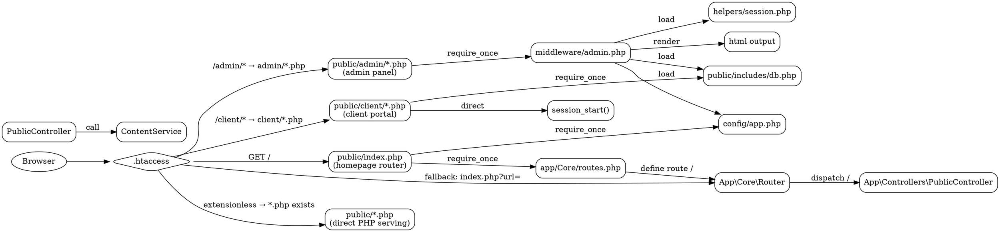

# ROUTE GRAPH

> Generated: Complete route analysis of all entry points

---

## 1. MODERN ROUTER (App\Core\Router)

### Defined Routes

| Method | Route | Handler | Middleware | Status |
|--------|-------|---------|------------|--------|
| GET | `/` | `PublicController@index` | None | ✅ Active |

### Undefined Routes (called via JS or forms but NOT registered)

| Route | Method | Expected Handler | Risk |
|-------|--------|-----------------|------|
| `/admin/*` | GET | AdminController | ⚠️ Not registered - loaded via .htaccess rewrite to PHP files |
| `/api/estimator/*` | GET/POST | EstimatorController | ⚠️ Not registered - handled by routes/api_estimator.php |
| `/client/*` | GET | ClientController | ⚠️ Not registered - loaded via public/client/*.php directly |

---

## 2. LEGACY ROUTER (core/Router.php - UNUSED)

The legacy `core/Router.php` is loaded by the PSR-4 autoloader fallback but **never instantiated**.
All modern code uses `App\Core\Router`.

**Verdict**: DEAD CODE - Safe to delete after verifying no dynamic includes reference it.

---

## 3. .HTACCESS ROUTING (public/.htaccess)

```
RewriteEngine On

Rule 1: RewriteRule ^includes - [F,L]                          # Block includes/
Rule 2: RewriteCond %{REQUEST_FILENAME} !-d
        RewriteRule ^(.*)/$ /$1 [L,R=301]                      # Trailing slash remove
Rule 3: RewriteCond %{REQUEST_FILENAME} !-f
        RewriteCond %{REQUEST_FILENAME} !-d
        RewriteCond %{REQUEST_FILENAME}.php -f
        RewriteRule ^(.+?)/?$ $1.php [L]                        # Extensionless PHP
Rule 4: RewriteCond %{REQUEST_FILENAME} !-f
        RewriteCond %{REQUEST_FILENAME} !-d
        RewriteRule ^(.+)$ index.php?url=$1 [QSA,L]             # Fallback to router
```

### Route Resolution Flow

```
Browser: GET /about-us
  ↓
.htaccess Rule 3: /about-us.php exists → serve directly
  ↓
public/about-us.php

Browser: GET /projects
  ↓
.htaccess Rule 3: /projects.php exists → serve directly
  ↓
public/projects.php

Browser: GET /admin/dashboard
  ↓
.htaccess Rule 3: /admin/dashboard.php exists → serve directly
  ↓
public/admin/dashboard.php
  ↓
middleware/admin.php → helpers/session.php → validateSession()

Browser: GET / (homepage)
  ↓
.htaccess: DirectoryIndex index.php
  ↓
public/index.php
  ↓
config/app.php → helpers/functions.php → app/Core/routes.php → Router::dispatch()
```

---

## 4. API ROUTES (routes/api_estimator.php)

| Method | Endpoint | Handler | CSRF | Rate Limit | Status |
|--------|----------|---------|------|------------|--------|
| GET | `/api/estimator?action=packages` | Inline SQL | No | No | ✅ Active |
| POST | `/api/estimator?action=calculate` | Inline SQL + validation | Yes | 30/3600 | ✅ Active |
| POST | `/api/estimator?action=lead` | Inline SQL + validation | Yes | 10/3600 | ✅ Active |

**Issues**:
- NOT using `App\Core\Router` - loaded via direct .htaccess fallback
- Contains inline SQL (not in Repository)
- CSRF validation uses custom `validateCsrf()` from helpers/csrf.php
- CORS headers set manually

---

## 5. ROUTE INVENTORY (All Public Pages)

| Route Pattern | File | Type | Accessed Via | Middleware |
|--------------|------|------|-------------|-----------|
| `/` | public/index.php | Homepage | .htaccess Rule 3 | None |
| `/about-us` | public/about-us.php | Static | Extensionless | None |
| `/services` | public/services.php | Static | Extensionless | None |
| `/projects` | public/projects.php | Dynamic | Extensionless | None |
| `/project-details` | public/project-details.php | Dynamic | Extensionless | None |
| `/blogs` | public/blogs.php | Dynamic | Extensionless | None |
| `/blog-details` | public/blog-details.php | Dynamic | Extensionless | None |
| `/gallery` | public/gallery.php | Static | Extensionless | None |
| `/contact` | public/contact.php | Form | Extensionless | None |
| `/faq` | public/faq.php | Static | Extensionless | None |
| `/estimator` | public/estimator.php | Interactive | Extensionless | None |
| `/testimonials` | public/testimonials.php | Dynamic | Extensionless | None |
| `/packages` | public/packages.php | Dynamic | Extensionless | None |
| `/careers` | public/careers.php | Static | Extensionless | None |
| `/privacy` | public/privacy.php | Static | Extensionless | None |
| `/terms` | public/terms.php | Static | Extensionless | None |
| `/login` | public/login.php | Form | Extensionless | Guest |
| `/register` | public/register.php | Form | Extensionless | Guest |
| `/forgot-password` | public/forgot-password.php | Form | Extensionless | Guest |
| `/reset-password` | public/reset-password.php | Form | Extensionless | Guest |
| `/phone-login` | public/phone-login.php | Form | Extensionless | Guest |
| `/logout` | public/logout.php | Action | Extensionless | None |
| `/404` | public/404.php | Error | Extensionless | None |
| `/admin` | public/admin/index.php | Dashboard | Extensionless | admin.php |
| `/admin/login` | public/admin/login.php | Form | Extensionless | admin-guest.php |
| `/admin/logout` | public/admin/logout.php | Action | Extensionless | None |
| `/admin/dashboard` | public/admin/dashboard.php | Dashboard | Extensionless | admin.php |
| `/admin/blogs/*` | public/admin/blogs/*.php | CRUD | Extensionless | admin.php |
| `/admin/leads/*` | public/admin/leads/*.php | CRUD | Extensionless | admin.php |
| `/admin/clients/*` | public/admin/clients/*.php | CRUD | Extensionless | admin.php |
| `/admin/projects/*` | public/admin/projects/*.php | CRUD | Extensionless | admin.php |
| `/admin/quotations/*` | public/admin/quotations/*.php | CRUD | Extensionless | admin.php |
| `/admin/media/*` | public/admin/media/*.php | CRUD | Extensionless | admin.php |
| `/admin/testimonials/*` | public/admin/testimonials/*.php | CRUD | Extensionless | admin.php |
| `/admin/services/*` | public/admin/services/*.php | CRUD | Extensionless | admin.php |
| `/admin/portfolio/*` | public/admin/portfolio/*.php | CRUD | Extensionless | admin.php |
| `/admin/estimators/*` | public/admin/estimators/*.php | CRUD | Extensionless | admin.php |
| `/admin/reports/*` | public/admin/reports/*.php | Reports | Extensionless | admin.php |
| `/admin/security/*` | public/admin/security/*.php | Security | Extensionless | admin.php |
| `/admin/settings/*` | public/admin/settings/*.php | Settings | Extensionless | admin.php |
| `/admin/users/*` | public/admin/users/*.php | CRUD | Extensionless | admin.php |
| `/admin/videos/*` | public/admin/videos/*.php | CRUD | Extensionless | admin.php |
| `/admin/cms/*` | public/admin/cms/*.php | CMS | Extensionless | admin.php |
| `/client/dashboard` | public/client/dashboard.php | Dashboard | Extensionless | client.php |
| `/client/*` | public/client/*/*.php | All client | Extensionless | client.php |

---

## 6. DUPLICATE ROUTES

| Route | Duplicated In | Risk |
|-------|--------------|------|
| `/admin/login` | public/admin/login.php + app/views/auth/admin-login.php (view) | ✅ Legitimate - view vs page |
| `/login` | public/login.php + middleware/guest.php redirects | ✅ Legitimate |

---

## 7. 404 RISKS (Broken Links Found)

| Source File | Broken Link | Reason |
|-------------|------------|--------|
| `public/index.php` (template) | `project-details.php?slug=` | Uses `$project['slug']` - works if slug is set |
| `public/index.php` (template) | `blog-details.php?slug=` | Uses `$blog['slug']` - works if slug is set |
| Admin sidebar links | Various `base_url()` paths | ✅ All use dynamic base_url() |
| Client sidebar links | Various `base_url()` paths | ✅ All use dynamic base_url() |

---

## 8. DEAD ROUTES

| Route | File | Reason | Verdict |
|-------|------|--------|---------|
| Any route via `core/Router.php` | core/Router.php | Router is never instantiated | **SAFE TO DELETE** |
| `mod_rewrite` to `index.php?url=$1` for PHP files | .htaccess Rule 4 | Only triggers for non-PHP URLs | Never matched for PHP files |

---

## 9. ROUTE GRAPH (Graphviz DOT)



## 10. ROUTE STATISTICS

| Category | Count |
|----------|-------|
| Modern registered routes (App\Core\Router) | 1 |
| Static PHP pages | 19 |
| Admin PHP pages | 70+ |
| Client PHP pages | 20 |
| API endpoints (routes/api_estimator.php) | 3 |
| Middleware files | 8 |
| Routes using middleware | ~90 |
| Routes with NO middleware | ~20 |
| Dead routes | 2 (core/Router.php routes) |
| 404 risk routes | 0 (all pages exist) |
| Duplicate route handlers | 0 |

